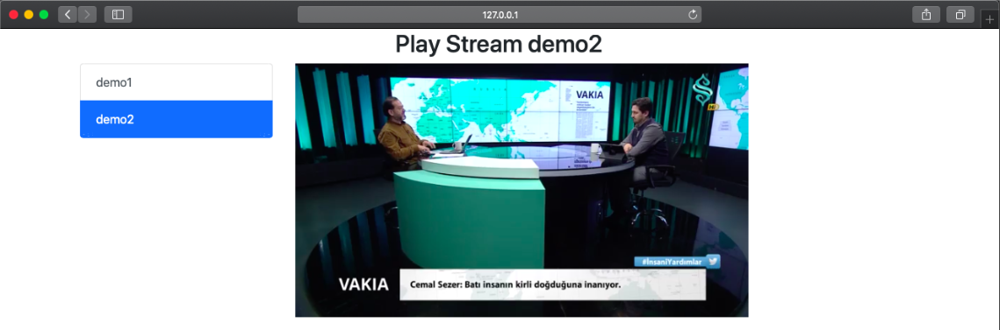

# rtsp-to-webrtc



Minimal latency, Go implementation of RTSP Stream to web browser over WebRTC based on Pion library (Full native! Whitout ffmpeg or gstreamer libraries).

This project is a fork of [RTSPtoWebRTC](https://github.com/deepch/RTSPtoWebRTC) project with small changes.

## Installation

```bash
$ git clone https://github.com/gregorfelkar/rtsp-to-webrtc.git
$ cd rtsp-to-webrtc
$ go mod download
```

## Configuration

### Edit file config.json

You can edit the config.json file to add your own streams in `streams` object. Each stream must have a unique name and a valid RTSP URL.

```bash
{
  "server": {
    "http_port": ":8083",
    "ice_servers": []
  },
  "streams": {
    "cam1": {
      "on_demand": false,
      "disable_audio": true,
      "url": "rtsp://[ip]:[port]/[stream]"
    },
    "camXY": {
      "on_demand": false,
      "disable_audio": false,
      "url": "rtsp://[username]:[password]@[ip]:[port]/[stream]"
    },
    "custom-stream-name": {
      "on_demand": true,
      "disable_audio": true,
      "url": "rtsp://[url]"
    }
  }
}
```

## Build and run

#### Run development

```bash
$ go run *.go
```

#### Build and run locally

```bash
$ go build
$ ./rtsp-to-webrtc
```

#### Build and run in Docker

```bash
$ docker build --platform linux/amd64 -t gregorfelkar/rtsp-to-webrtc .
$ docker run -p 8083:8083 rtsp-to-webrtc
```

## Docker compose

```yml
services:
  rtsp-to-webrtc:
    image: gregorfelkar/rtsp-to-webrtc
    container_name: rtsp-to-webrtc
    ports:
      - "8083:8083"
    volumes:
      - ./[path-to-your-config]/config.json:/app/config.json
```

## Web implementation example

For a custom web implementation take a look at `web/static/js/app.js` and `web/templates/player.tmpl` files. Or try out minimal example below:

```html
<!DOCTYPE html>
<html lang="en">
  <head>
    <meta charset="UTF-8" />
    <meta name="viewport" content="width=device-width, initial-scale=1.0" />
    <title>Document</title>
  </head>
  <body>
    <video
      id="video-container"
      style="width: 640px; height: 480px;"
      autoplay
    ></video>
    <script>
      const id = "cam1";
      const element = document.getElementById("video-container");

      const stream = new MediaStream();
      const webrtc = new RTCPeerConnection();

      webrtc.onnegotiationneeded = async () => {
        const offer = await webrtc.createOffer();
        await webrtc.setLocalDescription(offer);

        const data = new FormData();
        data.append("data", btoa(webrtc.localDescription?.sdp ?? ""));

        const offerResponse = await fetch(
          `http://localhost:8083/stream/offer/${id}`,
          {
            method: "POST",
            body: data,
          }
        );

        const offerSdp = await offerResponse.text();

        webrtc.setRemoteDescription(
          new RTCSessionDescription({
            type: "answer",
            sdp: atob(offerSdp),
          })
        );
      };

      webrtc.ontrack = async (event) => {
        stream.addTrack(event.track);
        element.srcObject = stream;
      };

      webrtc.addTransceiver("video", {
        direction: "recvonly",
      });
    </script>
  </body>
</html>
```

When running the project, the built-in preview example is available at:

```bash
$ open http://localhost:8083
```

## Limitations

Video Codecs Supported: `H264`

Audio Codecs Supported: `pcm alaw`, `pcm mulaw`

## Team

Deepch - https://github.com/deepch streaming developer

Dmitry - https://github.com/vdalex25 web developer

Gregor - https://github.com/gregorfelkar developer
